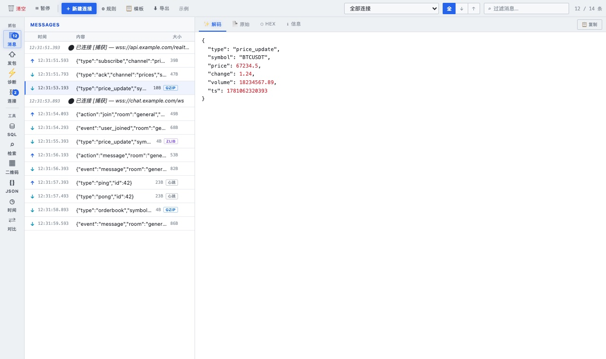
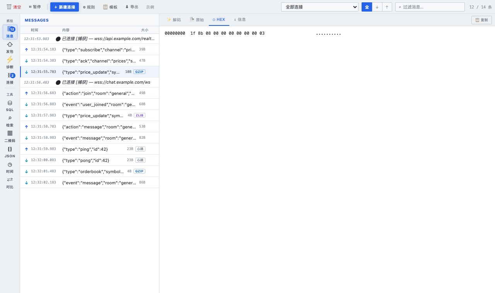
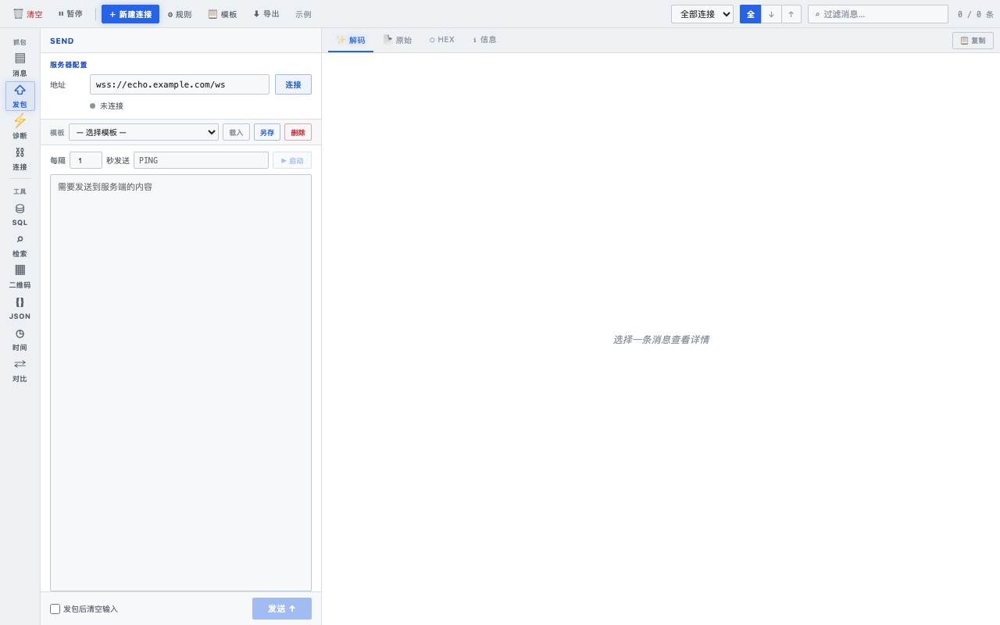
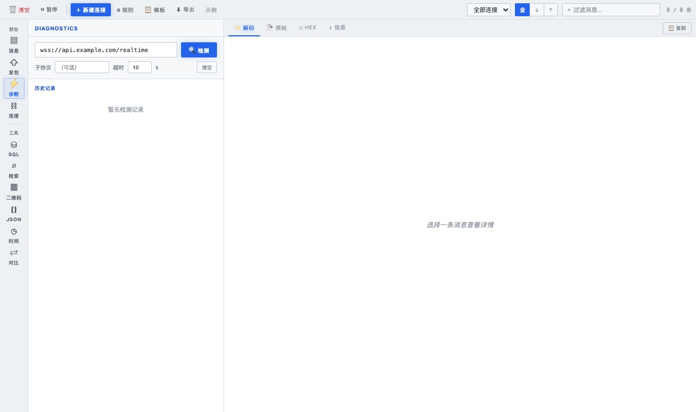
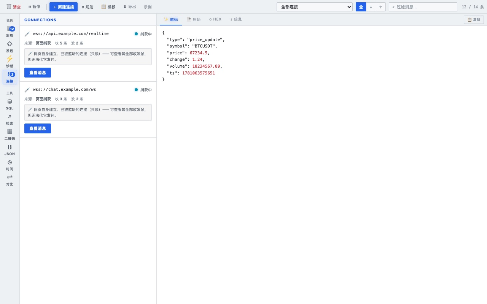

# Atool — WebSocket 抓包 + 开发工具箱

> 一款面向开发者的 Chrome 扩展：以成熟的 WebSocket 抓包/调试器为核心，
> 并把日常高频用到的开发小工具（SQL 生成/检索、二维码、JSON、时间日期、文本对比）
> 收纳进同一个简洁的亮色三栏面板，切换即用。

支持两种打开方式：**DevTools 面板** 与 **浏览器侧栏**。

---

## 目录

- [功能总览](#功能总览)
- [安装](#安装)
- [两种打开方式](#两种打开方式)
- [WebSocket 抓包](#websocket-抓包)
- [开发工具](#开发工具)
  - [SQL 生成](#1-sql-生成)
  - [SQL 检索](#2-sql-检索)
  - [二维码](#3-二维码)
  - [JSON 工具](#4-json-工具)
  - [时间日期](#5-时间日期)
  - [文本对比](#6-文本对比)
- [隐私说明](#隐私说明)
- [开发与打包](#开发与打包)
- [目录结构](#目录结构)

---

## 功能总览

| 分组 | 工具 | 说明 |
|------|------|------|
| **抓包** | 消息 | 实时截获页面所有 WebSocket 帧，自动解压 gzip/deflate，按连接分组 |
| | 发包 | 主动建立 ws:// / wss:// 连接并发送报文，支持模板与定时发送 |
| | 诊断 | 检测 WSS 端点可达性（DNS → TLS → 握手逐步时间轴） |
| | 连接 | 查看所有连接（捕获/主动），心跳、自动重连、订阅规则配置 |
| **工具** | SQL 生成 | 中文文案翻译为 18 语言并生成 `static_lang` / `static_lang_error` INSERT SQL |
| | SQL 检索 | 粘贴 INSERT 语句，按 source/error_tag/文案检索过滤、查看单条明细 |
| | 二维码 | 文本/链接转二维码（支持中文），导出 PNG |
| | JSON | 格式化 / 压缩 / 去注释 / 排序键 / 转义 / 去转义 |
| | 时间日期 | 时间戳 ↔ 日期互转，多时区换算 |
| | 文本对比 | 两段文本逐行 diff，增删高亮 |

---

## 安装

### 方式一：下载 Release（推荐普通用户）

1. 前往 [Releases](../../releases) 下载最新的 `atool-vX.Y.Z.zip`
2. 解压到一个固定目录
3. Chrome 打开 `chrome://extensions/`，开启右上角 **开发者模式**
4. 点击 **「加载已解压的扩展程序」**，选择解压后的目录

### 方式二：克隆源码（开发者）

```bash
git clone git@github.com:kary2999/atool.git
# chrome://extensions → 开发者模式 → 加载已解压的扩展程序 → 选择仓库目录
```

> 更新扩展后，已打开的页面需 **刷新（F5）** 才会注入新的抓包脚本；侧栏需关闭重开。

---

## 两种打开方式

| 模式 | 入口 | 特点 |
|------|------|------|
| **浏览器侧栏** | 点击工具栏的 Atool 图标 | 固定在页面右侧，自动跟随标签页切换，无需打开 DevTools |
| **DevTools 面板** | F12 → 顶部 **Atool** 标签页 | 嵌入开发者工具，与 Network / Console 并列 |

左侧图标导航分两组：**抓包**（消息/发包/诊断/连接）与 **工具**（SQL/检索/二维码/JSON/时间/对比）。

---

## WebSocket 抓包

### 消息



打开任意使用 WebSocket 的页面并刷新，所有帧自动出现，按连接分组：

- **方向**：↑ 发送（绿）/ ↓ 接收（青）
- **徽章**：GZIP / ZLIB（已自动解压）、心跳、规则命中
- **过滤**：顶部可按连接、方向（全/↓/↑）、关键词过滤
- **详情**：点任意消息，右侧四种视图——
  解码 JSON（语法高亮）/ 原始文本 / **HEX** / 信息
- **键盘**：`↑/↓` 在列表移动，`←/→` 切换详情视图
- **右键**：复制 / 重发 / 置顶 / 删除



### 发包



填写 `wss://` 地址连接后，可手动发送报文，或设置「每隔 N 秒自动发送」。
常用报文可存为 **模板** 一键载入。

### 诊断



输入 WSS 地址，逐步检测 **DNS 解析 → TLS → 握手** 是否可达，带耗时时间轴与历史记录。
写客户端代码前快速验证端点是否通。

### 连接



列出所有连接，每张卡片标明角色：

- **💉 页面捕获（只读）**：网页自身建立、已被监听的连接。可点 **「查看消息」** 过滤到该连接的全部收发帧；无法代它发包。
- **🔌 主动建立**：你从面板建立的连接。可发送消息、配置 **心跳保活** 与 **指数退避自动重连**。

还可配置 **订阅规则**：连接成功后自动发送帧（认证 token、订阅报文），并按关键词/正则/JSON 字段对消息着色高亮。

---

## 开发工具

> 所有工具统一为「左侧输入 · 右侧实时输出」，结果支持一键复制 / 导出。

### 1. SQL 生成

把中文文案翻译为 18 种语言并生成 INSERT SQL，带语法高亮。

- 两种表：`static_lang`（lang_tag/type）与 `static_lang_error`（source/error_tag/error_level/extend）
- 列顺序严格对齐建表 DDL；数字字段不加引号、字符串字段自动转义
- 「译文表」标签可查看每种语言的翻译对照
- ⚠ 翻译会调用 Google 翻译接口，需联网，详见[隐私说明](#隐私说明)

### 2. SQL 检索

粘贴已有的 `INSERT INTO static_lang_error ... VALUES (...),(...);`，
按 **source / error_tag / 任意语言文案** 实时检索过滤，命中高亮。
点任意结果，右侧显示该行**单条 INSERT**（保真还原引号）与**字段明细表**。

### 3. 二维码

文本 / 链接转二维码：

- 支持中文（UTF-8 字节编码）
- 纠错级别 L/M/Q/H、像素大小可调
- 输出真 PNG，可下载

### 4. JSON 工具

对 JSON 文本一键处理：**格式化 / 压缩 / 去注释（`//`、`/* */`、尾随逗号）/ 排序键 / 转义 / 去转义**，并校验合法性。

### 5. 时间日期

时间戳 ↔ 日期互转：

- 自动识别秒（10 位）/ 毫秒（13 位）时间戳
- **日期字符串按所选时区解释**（支持半点时区与夏令时校正）
- 输出标准时间（秒/毫秒）、Unix 时间戳、ISO 8601、星期，每行可「加载」回填

### 6. 文本对比

粘贴两段文本（原文 A / 对比 B），逐行 diff：新增绿色、删除红色，带增删行数统计。

> 📸 上述 6 个工具的截图见 `docs/screenshots/`（如缺失可自行截图补充，文件名见本节锚点）。

---

## 隐私说明

- **WebSocket 抓包 / 解码 / 诊断 / 发包** —— 100% 本地运行，数据不出本机
- **二维码 / JSON / 时间日期 / 文本对比** —— 全部本地计算，不联网
- ⚠ **唯一例外**：「SQL 生成」的多语言翻译会把你输入的中文文案发送到
  Google 翻译接口（`translate.googleapis.com`）以获取译文；
  **不使用该功能时，扩展不会产生任何外发网络请求**
- 不收集、不存储任何用户身份信息；抓包消息仅保存在内存，关闭即释放
- 完全开源，代码可审计

---

## 开发与打包

```bash
# 本地打包（按 manifest.json 版本号产出 atool-v<版本>.zip，仅含运行文件）
bash scripts/build.sh
```

### 发布新版本

推送 `v*` 标签会触发 GitHub Actions 自动校验版本、打包并发布 Release（附带 zip）：

```bash
# 1. 修改 manifest.json 的 version（如 2.0.2）
# 2. 提交并推送 main
git commit -am "chore: bump 2.0.2" && git push
# 3. 打 tag 并推送 → 自动出 Release
git tag v2.0.2 && git push origin v2.0.2
```

> CI 会校验 tag（去掉前缀 v）与 `manifest.json` 的 version 一致，不一致则失败。

---

## 目录结构

```
atool/
├── manifest.json          扩展清单（MV3）
├── background.js          service worker（点击图标开侧栏）
├── content-script.js      注入页面、转发 WS 事件
├── injected.js            页面上下文里 patch WebSocket
├── devtools.html/js       DevTools 面板入口
├── panel.html/js          主面板 UI 与逻辑（抓包 + 工具切换）
├── sql-tools.js           SQL 生成 / 检索
├── tools.js               二维码 / JSON / 时间 / 文本对比
├── decompress.js          gzip/deflate 自动解压
├── lib/qrcode.js          二维码生成库（MIT）
├── icons/                 扩展图标
├── scripts/build.sh       打包脚本
├── .github/workflows/     Release 自动化
└── docs/store/            商店上架文案与截图
```

---

## License

源码开源，可自由审计与二次开发。二维码生成使用 [qrcode-generator](https://github.com/kazuhikoarase/qrcode-generator)（MIT）。
